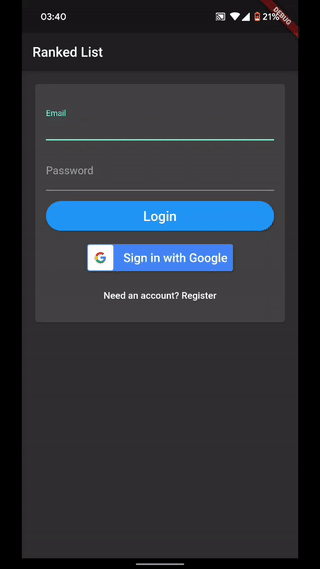
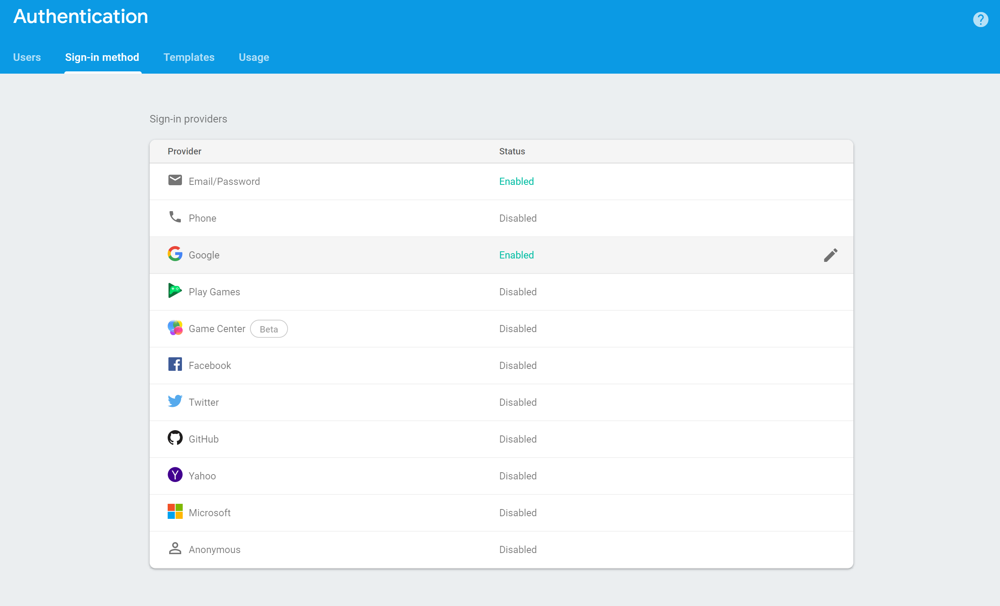

# FlutterFire Authentication

Base project code for integrating Firebase Authentication into a Flutter application.



# Setup

## API Setup

### Overall Firebase Project Creation

1. Setup the Firebase API via the [`Firebase Console`](https://console.firebase.google.com/). 

2. Once logged in, create a new Firebase project and follow the directions on how to add the API token to your project to utilize the FirebaseAuthentication features. 

3. Additional Flutter specific tutorial can be found [`here`](https://firebase.google.com/docs/flutter/setup).

### Setup Authentication Providers

1. Click on Authentication in the [`Firebase Console`]((https://console.firebase.google.com/)) and click on the `Sign-in method` tab.

2. Enable `Email/Password` and `Google`.



## Update Dependencies

Make sure to run the following command to update the dependencies specified in [`pubspec.yaml`](./pubspec.yaml)

```bash
flutter packages get
```

## Run Project

1. Make sure a device or emulator is connected/running.

2. Run the following command:

```bash
flutter run
```
